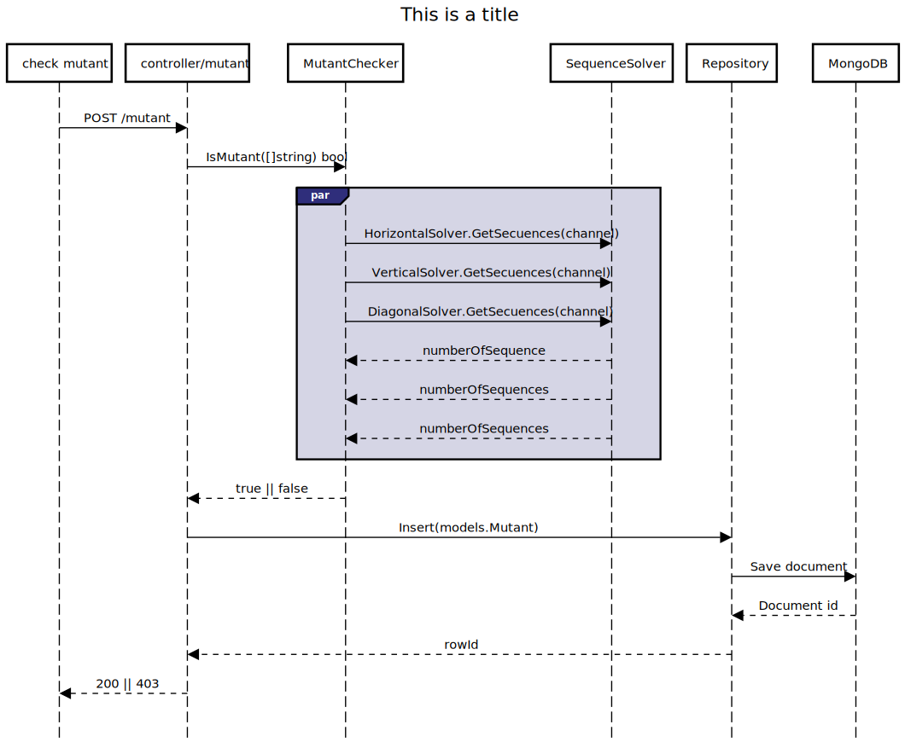

# mutant-checker
go project

## 1. Instalación.

Para correr este proyecto necesitas tener instalado Docker, ya que el ambiente de desarrollo está configurado con dicha herramienta.

### 2. Instalación (MacOS, windows y linux).

Para correr con Make usa el comando `make dev-start`;

```sh
$ make dev-start
```

Si no cuentas con Make en tu sistema puedes compilar la imagen de Docker y levantarla con los siguientes pasos.

Compilar
```sh
$ docker build -f docker/dev/Dockerfile -t test.com/mutant-checker:dev .
```

Correr
```sh
$ docker run --rm -it \
	-p 4000:4001 \
	-v ${PWD}/cmd:/app/cmd \
	-v ${PWD}/infrastructure:/app/infrastructure \
	-v ${PWD}/domain:/app/domain \
	--env-file ./.env \
	test.com/mutant-checker:dev
```

## 3. Configuración del entorno.

El proyecto usa las siguientes variables de entorno:

`Solicitar archivo .env`

Ejemplo del archivo .env
```sh
API_URL=":4000"
ALLOW_ORIGINS="http://localhost:4000;http://localhost:4001"
ALLOW_HEADERS="content-type"
```

### 4. Ejecución de tests.

Para ejecutar los tests debes tener go >=V1.14 instalado.

Para correr con Make usa el comando `make tests`;

```sh
$ make tests
```

### 4. End-points.
GET http://{URL}/v1/stats


POST http://{URL}/v1/mutant
```sh
payload
{
    "dna": [
        "ATGCGA",
        "CAGTGC",
        "TTATGT",
        "AGAAGG",
        "CCCCTA",
        "TCACTC"
    ]
}
```


### 5. Diagrama de secuencia.
<p align="center"></p>

### 6. Diagrama de arquitectura.
<p align="center"></p>